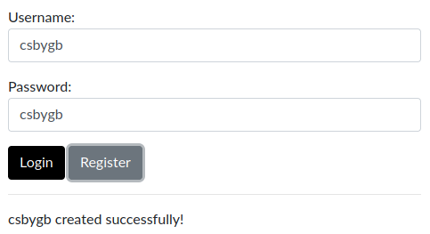
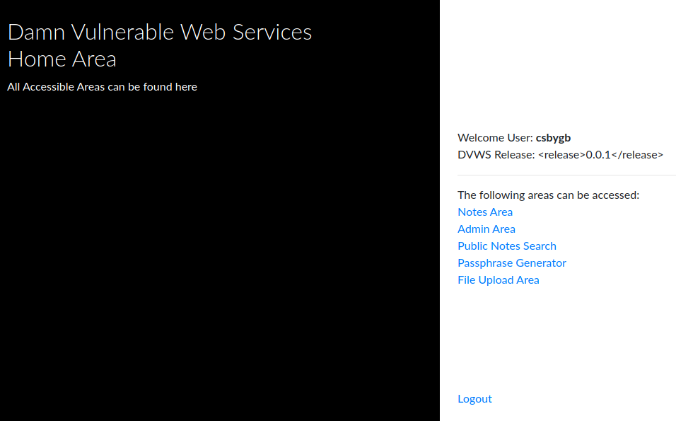
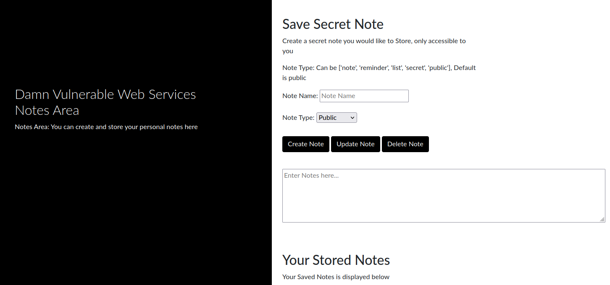
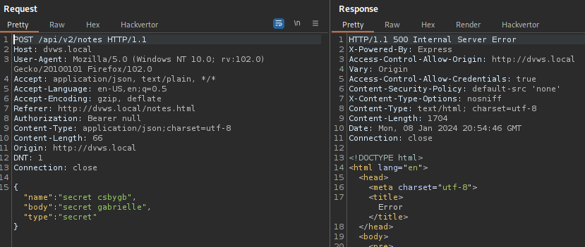

# Damn Vulnerable Web Service

## General info, Get it and deploy it

- [Official repo dvws](https://github.com/snoopysecurity/dvws-node)

### Infos

#### List of Vulnerabilities

> This is the list from the documentation  
> To keep track, I will check everytime I find one

- [ ] Insecure Direct Object Reference
- [ ] Horizontal Access Control Issues
- [ ] Vertical Access Control Issues
- [ ] Mass Assignment
- [ ] Cross-Site Scripting
- [ ] NoSQL Injection
- [ ] Server Side Request Forgery
- [ ] JSON Web Token (JWT) Secret Key Brute Force
- [ ] Information Disclosure
- [ ] Hidden API Functionality Exposure
- [ ] Cross-Origin Resource Sharing Misonfiguration
- [ ] JSON Hijacking
- [ ] SQL Injection
- [ ] XML External Entity Injection (XXE)
- [ ] Command Injection
- [ ] XPATH Injection
- [ ] XML-RPC User Enumeration
- [ ] Open Redirect
- [ ] Path Traversal
- [ ] Unsafe Deserialization
- [ ] Sensitive Data Exposure
- [ ] GraphQL Access Control Issues
- [ ] GraphQL Introspection Enabled
- [ ] GraphQL Arbitrary File Write
- [ ] GraphQL Batching Brute Force
- [ ] Client Side Template Injection

### Deploy it

- `git clone https://github.com/snoopysecurity/dvws-node.git`
- `cd dvws-node`
- `docker compose up`
- It should start building

  

- Once done edit your `/etc/hosts` file and add this line `127.0.0.1 dvws.local`

- All the other infos we need are here

```bash
web-1         | 🚀 XML-RPC server listening on port 9090
web-1         | 🚀 API listening at http://dvws.local (127.0.0.1)
web-1         | 🚀 GraphQL Server ready at http://localhost:4000/
```

## Hack it

- Launch burp or zap and setup your scope settings

### Exploration

#### Register

Now we can visit `http://dvws.local/` we get this page  

  

Let's create an account  

  

Once logged in we get this home page:

  

#### Home page without being logged in

However we do not need to be logged in to access the home page. We can access it right away if we go here `http://dvws.local/home.html`  

  

#### File upload functionality

Here `http://dvws.local/upload.html` we have the possibility to upload files. So this is definitely something to keep aside for later.  

  

#### PassPhrase Generator

Another page to keep for later explorations `http://dvws.local/passphrasegen.html`  

  

#### Public Notes

Another one `http://dvws.local/search.html`  


#### Admin Area

We can access the admin area as well without any cookie `http://dvws.local/admin.html`

  

  

#### Save Secret Note

This looks fun too `http://dvws.local/notes.html`  

  

If we try to create a note without a token it won't work. So we can access the page but we can not write notes.  

  

#### Directory and endpoint enumeration

- Directory enum small list

```bash
┌─[✗]─[gabrielle@parrot]─[~/vulnerable-apis/dvws-node/dvws-node]
└──╼ $wfuzz -c --hc 404 --hw 225 -w /usr/share/seclists/Discovery/Web-Content/directory-list-2.3-small.txt http://dvws.local/FUZZ
 /usr/lib/python3/dist-packages/wfuzz/__init__.py:34: UserWarning:Pycurl is not compiled against Openssl. Wfuzz might not work correctly when fuzzing SSL sites. Check Wfuzz's documentation for more information.
********************************************************
* Wfuzz 3.1.0 - The Web Fuzzer                         *
********************************************************

Target: http://dvws.local/FUZZ
Total requests: 87664

=====================================================================
ID           Response   Lines    Word       Chars       Payload                                                                                              
=====================================================================

000000164:   301        10 L     16 W       181 Ch      "uploads"                                                                                            
000000269:   301        10 L     16 W       179 Ch      "static"                                                                                             
000000549:   301        10 L     16 W       173 Ch      "css"                                                                                                
000000954:   301        10 L     16 W       171 Ch      "js"                                                                                                 
000008156:   301        10 L     16 W       173 Ch      "CSS"                                                                                                
000009299:   301        10 L     16 W       171 Ch      "JS"                                                                                                 

Total time: 63.89374
Processed Requests: 87664
Filtered Requests: 87658
Requests/sec.: 1372.027
```

- Directory enum big list

=> Nothing more than in the small one.

<!-- 
TODO:
- Fuzz API endpoints
- Look for API doc
-->

# COMING SOON

## Resources

- [OWASP API Security Top 10](https://owasp.org/API-Security/editions/2023/en/0x00-header/)